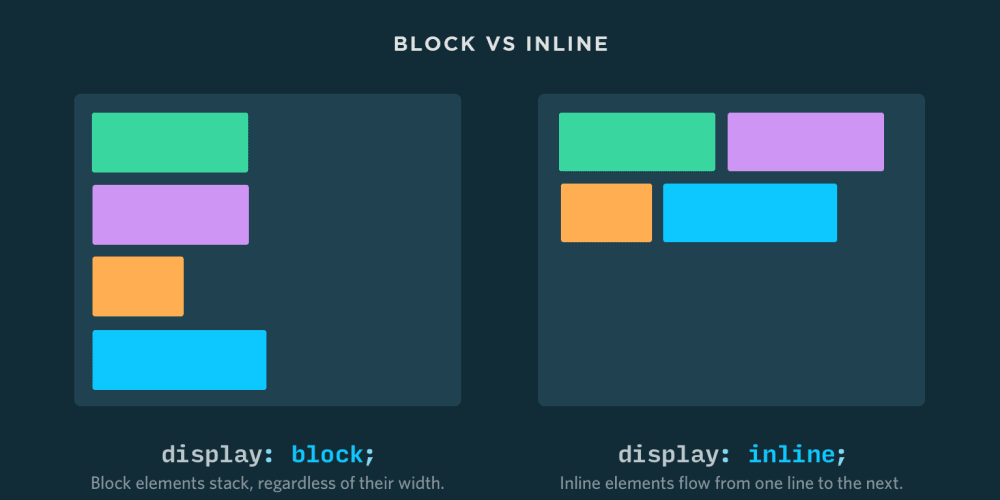

# Introduzione

HTTP è un protocollo a livello di applicazione stateless (senza stato) che permette la comunicazione tra sistemi distribuiti ed è le fondamenta del moderno web. Permette la comunicazione tra una varietà di host e client e supporta un insieme di configurazioni di network. HTTP si è evoluto da un protocollo progettato per scambiare file in un ambiente di laboratorio semi-fidato in un moderno labirinto Internet che contiene immagini e video ad alta risoluzione e 3D.

La comunicazione tra host e client avviene attraverso coppie richiesta/risposta. Il client inizializza un messaggio HTTP di richiesta che viene servito tramite un messaggio di risposta HTTP in cambio.

(I VERBs). Gli Urls rivelano l'identità di un particolare host ma l'azione che dovrebbe essere eseguita sull'host è specificata tramite verbi (o metodi) HTTP.

- GET: raggiunge una risorsa esistente
- POST: crea una nuova risorsa
- PUT: aggiorna una risorsa esistente (considerata come una POST specializzata)
- DELETE: cancella una risorsa esistente (considerata come una POST specializzata)

Con URLs e verbs, i client può inizializzare una richiesta al server. In ritorno, il server risponde con codici di stato e messaggi di payloads.

- 1XX: messaggi di info
- 2XX: messaggi di successo
- 3XX: messaggi di cache
- 4XX: client error messages
- 5XX: server error messages

<div style="page-break-after: always;"></div>

# HTML

Linguaggio di markup (standard) per creare pagine web. <b>Non è</b> un linguaggio di programmazione, non ha i costrutti dei linguaggi di programmazione. Descrive la struttura di pagine web con elementi rappresentati da `<tags>`. L'obbiettivo di un browser web è quello di leggere documenti HTML e visualizzarli.

<b>Project folder:</b> un progetto html ha la seguente struttura

```
project_folder   
│
└───assets
│   │   
│   │
│   └───css
│   |   │   file1.css
│   |   │   ...
|   |
│   └───js
|   |   |   file1.js
|   |   |   ...
│   └───img
|       |   ...
|       |
└   index.html
```

La dichiarazione `<!DOCTYPE>` rappresenta il tipo del documento, aiuta i browser a mostrare le pagine web correttamente
HTML 4.01 `<!DOCTYPE HTML PUBLIC "-//W3C//DTD HTML 4.01//EN" "http://www.w3.org/TR/html4/strict.dtd">`
HTML 5 `<!DOCTYPE html>`

Struttura pagina HTML:
```HTML
<!DOCTYPE html>
<html>
    <head>
        <title>Title here!</title>
    <!-- META INFO --> 
    </head>
    <body>
    <!-- ELEMENTS HERE -->
    </body>
</html>
```
Tutti i nodi dell'albero sono da considerare come elementi html. Se un elemento contiene altri elementi, finisce con un tag di chiusura dove il nome dell'elemento è preceduto da uno slash `/`. Un elemento HTML può essere `block` o `inline`.



## Elementi inline
Non inizia su una nuova riga, occupano solo la larghezza necessaria

```HTML
<span>some text</span>
<b>bold text</b>
<i>Italic</i>
<small>small text</small>
<a href="">link</a>
```

## Elementi block
Inizia sempre su una nuova riga e i browser aggiungono automaticamente dello spazio (un margine) prima e dopo l'elemento. Occupa sempre l'intera largheza disponibile (si estende a sinistra e a destra il più possibile)

```HTML
<p>some text</p>
<div>Container</div>
<h6>Small text</h6>
<h2>Some text</h2>
<ul>Italic!</ul>
```

## Elementi void

Vi sono alcuni elementi HTML che non hano bisogno di essere chiusi (possono comunque avere attributi).

`<br /> <hr />  <input />`

Vi sono anche area, base, col, command, hr, keygen, link, meta, param, source, track, wbr.

## Element attributes

Un attributo è usato per definire le caratteristiche di un elemento HTML ed è posto dentro il tag di apertura dell'elemento. Tutti gli attributi sono formati da due parti `key="value"`. Vi sono i totali quattro attributi che possono essere usati in tutti gli elementi HTML (nativi), altri elementi hanno i propri attributi

- ID: unico identificatore di un elemento HTML
- Class: group HTML element identifier
- Style: define some style inlne
- Title: description, this will display in a tooltip

## Hyperlinks

Permettono ai visitatore di lavorare tra pagine web cliccando su parole, immagini, frasi. È un elmento <u>inline</u>.

`<a [attributes]>...</a>`

- `href`definisce l'URL del documento
- `target` questo attributo è usato per specificare la posizione del documento che sarà aperto:
    - `_self`: default. Carica il documento nello stesso context
    - `_blank`: carica il documento in una nuova finestra o tab del browser
    - `_parents`: carica il documento nel context/frame di navigazione padre, se presente, o nello stesso contesto di navigazione se non esiste un elemento padre
    - `_top`: carica il documento nel context/riquadro di nagiazione più in alto se c'è qualcuno, o nello stesso contesto di navigazione se non c'è un genitore

- È possibile creare un link per una particolare sezione della webpage utilizzando `id`o `name` dopo `href` con un `#` davanti

```HTML
<a href=”#test”>Click here</a>
…
…
…
<p id=”test”>Hello!</p>
```

## Images

Le immagini sono definite dal tag ``, è un tag void che contiene solo attributi e non ha un tag di chiusura

``

- `src`: definisce l'URL dell'immagine (PNG,JPG,GIF,SVG) o una stringa base64;
- `alt`: attributo alt fornisce un testo per l'immagine
- `width`: definisce la larghezza
- `height:` definisce l'altezza

## Tables

Le tabelle HTML solo state create per rappresentare dati, successivamente sono stante anche utilizzate (non più) per gestire la struttura delle pagine web. Per ogni tabella bisogna assegnare un’unica `<table>`. Poi per ogni riga che si vuole creare devi racchiudere tra `<tr>`. Per ogni colonna che vuoi fare devi mettere `th` per l’header o `td` per le righe normali

- `table` con chiusura
- `tr` table row
- `th` table header
    - Per fare si che la cella abbia un intervallo:
        - con più di una colonna basta usare l'attributo `colspan="numero"`
        ```HTML
        <table style="width:100%">
            <tr>
                <th colspan="2">Name</th>
                <th>Age</th>
            </tr>
            <tr>
                <td>Jill</td>
                <td>Smith</td>
                <td>43</td>
            </tr>
            <tr>
                <td>Eve</td>
                <td>Jackson</td>
                <td>57</td>
            </tr>
        </table>
        ```
        - con più di una colonna basta usare l'attributo `rowspan="numero"`
        ```HTML
        <table style="width:100%">
            <tr>
                <th>Name</th>
                <td>Jill</td>
            </tr>
            <tr>
                <th rowspan="2">Phone</th>
                <td>555-1234</td>
            </tr>
            <tr>
                <td>555-8745</td>
            </tr>
        </table>
        ```
- `td` table data

## Lists

Permette di fare una lista di vari elementi. Sono elementi di tipo `block`. Due tipi:
    - unordered list (non ordinata) `<ul>`
    - ordered list (ordinata) `<ol>`
Ogni elemento della lista è un block element `<li>`

## DIVisor
Il tag `div`definisce una divisione o una sezione in un documento HTML, è un elemento di tipo block. È usato spesso con il CSS per dare un layout a una pagina web (invece di tables)

`<div> <!-- elements --> </div>`

## Forms

L'elemento form definisce un form usato per collezionare input da parte degli utenti. 
- possono avere diversi tipi di elementi di input come text fields, checkboxes, radio buttons, submit buttons ed altri;
- l'azione degli attributi definisce l'azione da eseguire quando il form è 'submitted'
- normalmente i dati del form sono inviati ad una web page su unserver quando l'utente clicca sul bottone di submit
- l'attributo `method` spefica il metodo http da essere utilizzando quando viene fatto il submit dei dati
    - `GET`: metodo di default, quando viene usato nel campo di indirizzo saranno visibili i campi della pagina (limite 255 caratteri). Non deve essere utilizzato per inviare informazioni sensibili;
    - `POST`: da usare quando vengono inviate informazioni sensibili. Non visualizza i dati nel campo indirizzo, né ha dei limiti per la dimensione dei dati

```HTML
<form action="http://..." method="get or post">
    <!-- form elements -->
</form>
```

### Inputs

L'elemento `<input>` è il più importante elemento form e può essere visualizzato in diversi modi, in base al tipo dell'attributo.

`<input type=”{TYPES}” name=”{NAME OF KEY}” [OTHER ATTRIBUTES] />`

Ogni campo deve vere il nome di un attributo per essere inviato e definisce il nome della chiave (o variabile). Se l'attributo name è omesso, i dati del campo di input non saranno inviati. 

#### Attributi
- `type` può avere diversi valori, quali: `text`, `password`, `email`, `number. I controlli di email e number sono forzati dal browser (quindi possono essere modificati !!)
- `value` il valore iniziale del campo di input
- `readonly` (attributo void) specifica che l'input non può essere cambiato
- `disabled` (attr. void) specifica che il campo di input è disabilitato. È inutilizzabilie, non cliccabile ed il suo valore non sarà inviato quando viene effettuato il submit di un form
- `maxlength` specifica la massima lunghezza del campo di input
- `placeholder` una hint che descrive il valore aspettato dal campo
- `min|max` minimum and maximum value (type `number`)

### Textarea

Per creare degli input multi linea

```HTML
<textarea name="sampletextarea" rows="10" cols="50">
...
</textarea>
```

- ha tutti gli attributi di `input`
- l'attributo rows definisce il numero di linee visibili
- l'attributo cols definisce definisce la larghezza visibile del controllo di testo, nella larghezza media dei caratteri.

### Checkbox

Renderizzati di default come quadrati che sono segnati (ticked) quando attivi. Permettono di selezionare più di un valore (o no) nel form. `checked` è usato per pre-selezionare l'input

`<input type="checkbox" name="nameoflist" value="val" checked> `

### Radios

Renderizzati di default come bottoni circolari che sono segnati (ticked) quando attivi. Permette di selezionare solo un valore in un form con lo stesso name attribute

`<input type="radio" name="nameoflist" value="val" checked> `

### Select

Permette di selezionare da un menu di opzioni. L'attributo `multiple` (void) permette di selezionare più di un valore nella lista

```HTML
<select name="select">
    <option value="1">value 1</option>
    <option value="1">value 2</option>
</select>
```

### Button

Il tag button definisce un bottone cliccabile. Dentro un elemento button è possibile inserire contenuto come testo o immagini. Questa è la differenza tra questo elemento e altri bottoni creati con l'elemento `<input>`

`<button [ATTRIBUTES]> Click me [OR OTHER HTML]</button>`