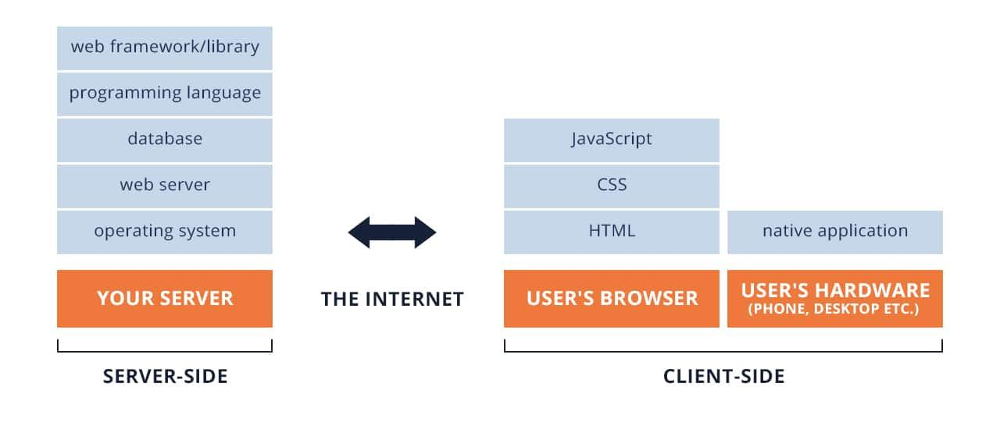

# JavaScript

JavaScript è un linguaggio di programmazione che permette di implementare cose complesse sulle web pages:



- È il terzo strato della torta a strati delle tecnologie web standard;
- È un linguaggio tipizzato dinamico (il tipo di dati diventa noto in fase di esecuzione) e un linguaggio multiparadigma (funzionale, imperativo, asincrono, ecc.);
- Linguaggio non bloccante a thread singolo;
- È l'implementazione dell'ECMA Script (o ES), ovvero la specifica tecnica standard del linguaggio di scripting e mantenuta dall'ECMA International. Fondamentalmente, le implementazioni dei linguaggi (come Javascript o Actionscript) sono state progettate solo per il client e lo sviluppo web (la versione più usata è la 6 ES6);
- (Data type conversion) È un linguaggio tipizzato dinamicamente. Non è necessario specificare il dato della variabile quando viene dichiarato ed i data types sono convertiti automaticamente come richiesto durante l'esecuzione dello script.

<b>Utilizzi:</b>

- Memorizza valori utili all'interno di variabili
- Operazioni su parti di testo
- Esecuzione di codice in risposta a determinati eventi che si verificano su una pagina web.
- Gestisci gli elementi HTML
- Può usare le API!
- Esegui alcune chiamate sincronizzate o asincrone a Internet
- Disegna e renderizza grafica 2D o 3D
- Ottiene la posizione
- Riproduci video e audio

<b>Funzionamento:</b>
- Il JavaScript viene eseguito dal motore JavaScript del browser, dopo che HTML e CSS sono stati assemblati e messi insieme in una pagina web: ciò garantisce che la struttura e lo stile della pagina siano già presenti nel momento in cui JavaScript inizia a essere eseguito. Questa è una buona cosa, poiché un uso molto comune di JavaScript è quello di modificare dinamicamente HTML e CSS per aggiornare un'interfaccia utente;
- Se JavaScript fosse stato caricato e tentato di essere eseguito prima che HTML e CSS potessero influire, si sarebbero verificati degli errori.

<b>Sicurezza:</b>

Ogni scheda del browser è il proprio bucket separato per l'esecuzione del codice, ciò significa che nella maggior parte dei casi il codice in ciascuna scheda viene eseguito completamente separato e il codice in una scheda non può influire direttamente sul codice in un'altra scheda o su un altro sito Web. È una buona misura di sicurezza, se così non fosse, i pirati potrebbero iniziare a scrivere codice per rubare informazioni da altri siti Web ed altro.

<b>Linguaggio interpretato vs compilato</b>

Anche i browser web lo eseguono in modalità sandbox quindi non puoi accedere direttamente al sistema host dell'utente (immagine se puoi quello che puoi installare o eliminare qualsiasi file dal computer del visitatore).

JavaScript è un linguaggio interpretato, il codice viene eseguito dall'alto verso il basso e il risultato dell'esecuzione del codice viene immediatamente restituito. Non è necessario trasformare il codice in una forma diversa prima che il browser lo esegua.

I linguaggi compilati, invece, vengono trasformati (compilati) in un'altra forma prima di essere eseguiti dal computer. Ad esempio, C/C++ vengono compilati in un linguaggio assembly che viene quindi eseguito dal computer.

<table>
    <tr>
    <p align="center">Javascript vs Java</p>
    </tr>
<tr>
    <th> Javascript </th>
    <th> Java </th>
</tr>
<tr>
    <td>
        - Orientato agli oggetti, l'ereditarietà avviene tramite il meccanismo del prototipo e le proprietà e i metodi possono essere aggiunti dinamicamente a qualsiasi oggetto;<br>
        - Nessuna distinzione tra tipi di oggetti;<br>
        - I tipi di dati variabili non vengono dichiarati (tipizzazione dinamica);<br>
        - Interpretato.
    </td>
    <td>
        - Basato sulle classi;<br>
        - Gli oggetti sono divisi in classi e istanze con tutta l'ereditarietà attraverso la gerarchia delle classi;<br>
        - Le classi e le istanze <u>non</u> possono avere proprietà o metodi aggiunti dinamicamente;<br>
        - I tipi di dati variabili devono essere dichiarati (tipizzazione statica);<br>
        - Semi-compilato (o semi-interpretato).
    </td>
</tr>
</table>

## Import di JavaScript

JavaScript viene applicato alla tua pagina HTML in modo simile ai CSS. Mentre CSS usa gli elementi `<link>` per applicare fogli di stile esterni e gli elementi `<style>` per applicare fogli di stile interni all'HTML, JavaScript ha bisogno solo di un amico nel mondo dell'HTML, l'elemento `<script>`.

Internal:

```javascript
<script>
// JavaScript goes here
</script>
```

External:

```javascript
<script src="script.js"></script>
```

Può essere inserito nella sezione `<head>`, tuttavia è meglio posizionarlo nella parte inferiore della sezione `<body>`, perché posizionare gli script lì migliora la velocità di visualizzazione, poiché la compilazione degli script ne rallenta la visualizzazione.

<b>Variabili</b>

I nomi delle variabili, detti identificatori, sono conformi a determinate regole. Un identificatore JavaScript deve iniziare con una lettera, un trattino basso (`_`) o un segno di dollaro (`$`); i caratteri successivi possono essere anche cifre (`0-9`). Poiché JavaScript fa distinzione tra maiuscole e minuscole, le lettere includono i caratteri da "A" a "Z" (maiuscolo) e i caratteri da "a" a "z" (minuscolo). Tre modi per dichiarare le variabili:
- keyword `var`: può essere usata per dichiarare sia variabili locali che globali
- Assegnando un valore, in questo modo si dichiarerà sempre una variabile globale. Se dichiarata fuori da ogni funzione, genera un `strict javascript warning` (non si dovrebbe usare)
- keyword `let`: sintassi usata per dichiarare block-scope local variables
- keyword `const`: dichiarare una block-scope local constant

Una variabile utilizzando solo `let` o `var` senza specificare il valore assegnato è `undefined`. La lunghezza di una stringa si ottiene con `.length`. Ogni carattere ha il suo indice il primo carattere è 0 ed arriva fino a `length-1`

## If

Se l'esecuzione dell'if e della specifica condizione è vera entra nella prima, altrimenti un altro stato viene eseguito.

Il costrutto `if ( Expression ) Statement` convertirà il risultato della valutazione dell'espressione a un valore booleano utilizzando il metodo astratto ToBoolean per il quale la specifica ES5 definisce il seguente algoritmo:

| Tipo argomento | Risultato |
| --- | --- |
| `undefined` | `false` |
| `null` | `false` |
| `boolean` | risultato uguale all'input (no conversione) |
| `number` | risultato è `falso` se l'argomento è <b>+0, -0, NaN</b>; altrimenti `true` |
| `string` | risultato è `falso` se l'argomento è una stringa vuota (lunghezza zero); altrimenti `true` |
| `object` | `true` |

## Switch

Valuta un espressione, che effettua un match con il valore della clausola case ed esegue lo stato associato a quel caso:

```
switch (expression){
    case value1:
        // ...
        [break;]
    case value2:
        // ...
        [break;]
    ...
    [default:
        // stato eseguito quando nessuno dei valori forniti ha un match con il valore dell'espressione
        [break;]]
}
```

## Operatori di comparazione

Gli operatori di confronto vengono utilizzati nelle istruzioni logiche per determinare l'uguaglianza o la differenza tra variabili o valori.

| Operatore | Descrizione |
| --- | --- |
| == | equal to |
| === | equal value and equal type |
| != | (inequality) not equal |
| !== | (strict inequality) not equal value or not equal type |
| > | greather than |
| < | less than |
| >= | greather than or equal to |
| <= | less than or equal to |

## Operatori ternari

L'operatore condizionale (ternario) è l'unico operatore JavaScript che accetta tre operandi. Questo operatore viene spesso utilizzato come scorciatoia per l'istruzione `if`.

`condition ? expr1 : expr2`

## While

L'istruzione while crea un ciclo che esegue un'istruzione specificata fintanto che la condizione di restituisca true. La condizione viene valutata prima di eseguire l'istruzione.

```
while (condition) {
    ...
}
```

## For

L'istruzione `for` crea un ciclo costituito da tre espressioni facoltative, racchiuse tra parentesi e separate da `;`, seguite da un'istruzione (solitamente un'istruzione di blocco) da eseguire nel ciclo. Per uscire preventivamente usare `break`. 

```for ([initialization]; [condition]; [final-expression]) statement```

Feature: utilizzando `in` o `of` Può creare un loop che itera tutti gli oggetti che sono dentro un iterabile

```
// utilizzando in

for (var index in arr){
    console.log(arr[index]);
}

// utilizzando of

for (var elem of arr){
    console.log(elem);
}
```

## Arrays
È un oggetto globale usato per la costruzione degli array, che sono ad alto livello come gli oggetti.

`.length` puoi accedere con la notazione ed arrivare fino ad per selezionare l'ultimo elemento `arr[arr.length - 1]`

<b>Utils</b>

```javascript
arr.forEach(function (item, index, arr) {
    //logging 'arr[index]' or 'item' gives the same result
});

let anyvalue = "" // number of obj 

.push(anyvalue); // aggiunge un elemento
.pop(); // remove last element
.shift(); // remove  from the front
.unshift(anyvalue) // add to the front
.push(anyvalue); // aggiunge alla fine
indexOf(anyvalue); // ritorna l'index dell'elemento. può essere anche un intero, se non presente ritorna -1
```

<b>Splice</b>

The `splice()` method changes the contents of an array by removing or replacing existing elements and/or adding new elements in place. To access part of an array without modifying it, see `slice()`.

Se applicato ad un array, quest'ultimo viene modificato. Altrimenti ritorna: an array containing the deleted elements.
- If only one element is removed, an array of one element is returned.
- If no elements are removed, an empty array is returned.

## Functions

La definizione di funzione consiste nell'utilizzo della keyword `function` seguita da:
- Nome della funzione
- Lista dei parametri della funzione, chiusi da parentesi e separati da virgole
- Lo stato JavaScript che definisce la funzione, racchiusa tra parentesi graffe

```
// metodo 1:
function square(number){
    return number * number;
}
```

Sebbene la dichiarazione di funzione precedente sia sintatticamente un'istruzione, le funzioni possono anche essere create da un'espressione di funzione. Tale funzione può essere <b>anonima</b>; non deve avere un nome:

```
// metodo 2:
var square = function(number) { return number * number; };
var x = square(4); // x gets the value 16
```
- È possibile passare come parametro una funzione (possibile anche definire un nome di una funzione per poter essere utilizzata all'interno della funzione stessa (o in un debugger per identificare la funzione in stack)
```
var factorial = function fac(n) { return n < 2 ? 1 : n * fac(n - 1); };
console.log(factorial(3));
```

### Arrow functions

https://developer.mozilla.org/en-US/docs/Web/JavaScript/Reference/Functions/Arrow_functions

È un'alternativa sintatticamente compatta a un'espressione di funzione regolare, sebbene senza i bind alle keyword `this`, `arguments`, `super` o `new.target`. Le espressioni di una arrow function non sono adatte come metodi e non possono essere utilizzate come costruttori.

```
let pippo = (param1, param2, ..., paramN) => { statements }
let pluto = (param1, param2, ..., paramN) => expression // eq to: => { return expression; }

// Parentheses are optional when there's only one parameter name:
(singleParam) => { statements }
singleParam => { statements }

// The parameter list for a function with no parameters should be written
with a pair of parentheses.
() => { statements }
```

Prima delle arrow functions, ogni nuova funzione definiva il proprio `this`

- Un nuovo oggetto nel caso di un costruttore
- `undefined` in `strict` mode function calls
- L'oggetto di base se la funzione è stata chiamata come "metodo dell'oggetto"

In alternativa, è possibile creare una funzione associata in modo che un valore preassegnato venga passato alla funzione di destinazione associata (con let)

- non ha il proprio `this` (se usato all'interno della funzione ritorna `undefined`). Viene utilizzato il valore `this` dell'ambito lessicale di inclusione; le arrow function seguono le normali regole di ricerca delle variabili. Quindi, durante la ricerca di `this` che non è presente nell'ambito corrente, una arrow function finisce per trovare `this` dal suo ambito di inclusione.

## Hoisting

L'hoisting (<i>in inglese hoisting</i>) è stato pensato come un modo generale di pensare a come funzionano i contesti di esecuzione (in particolare le fasi di creazione ed esecuzione) in JavaScript. Una definizione rigorosa di <b>hoisting</b> suggerisce che le dichiarazioni di variabili e funzioni vengono spostate fisicamente all'inizio del codice, ma in realtà non è ciò che accade. Invece, le dichiarazioni di variabili e funzioni vengono messe in memoria ma rimangono esattamente dove vengono scritte nel codice


```
var stud;
studentName(stud);  // logs --> My student's name is null
 function studentName(name) {
  console.log("My student's name is " + name);
}
stud = "pluto";
studentName(stud); // logs --> My student's name is pluto
```

## Scope

Le variabili hanno scope a livello di funzione, sono visibili nelle funzioni quando sono definite. RICORDA:

```
var d = 3

function test(){
  console.log(d)
}

test() // logs : 3
```

## Closure

JavaScript consente l'annidamento delle funzioni e garantisce alla funzione interna l'accesso completo a tutte le variabili e funzioni definite all'interno della funzione esterna (e a tutte le altre variabili e funzioni a cui la funzione esterna ha accesso).

```
var func1 = function(name) {
  var getName = function () {
    return name;
  }
  return getName;
}

var pet = func1("Pluto")

console.log(pet()) // returns 

// can do also with brackets function

var func2 = function(name) {
  var getName = () => name;
  
  return getName;
}

var pet2 = func2("Pluto")

console.log(pet2()) // returns "Pluto"

```


## Objects

Un oggetto è una collezione di dati e/o funzionalità. Così come molte cose in JavaScript, creando un oggetto dopo l'inizializzazione di una variabile

`var obj = { [key]:[value][,...]};`

```
var person = {
    name: ["Danilo", "Leo"],
    age: 28,
    bio: function() {
     alert(this.name[0] + ' ' + this.name[1] + ' is ' + this.age + ' years old.');
    },
    greeting: function() {
      alert('Hi! I\'m ' + this.name[0] + '.');
    }
};
person.bio()
console.log(person.age)
```

### Inheritance and prototype chain

https://developer.mozilla.org/en-US/docs/Web/JavaScript/Inheritance_and_the_prototype_chain

Javascript si basa sull'eredità del prototipo. In Javascript tutto è un Oggetto e ogni Oggetto mantiene un "collegamento" al suo prototipo e questo crea una catena di prototipi in cui gli oggetti possono ereditare comportamenti da altri oggetti. Questo differisce dall'ereditarietà classica in cui si definisce una classe o un design per ogni oggetto e ne si crea un'istanza. È uno dei concetti di basso livello che rende JavaScript un linguaggio multiparadigma molto flessibile.

```
const Animal = {race : "Human"};
const Person = Object.create(Animal);

console.log(Animal.race); //human
console.log(Person.race); //human
```

### Bracket notations

Simile al modo in si accede agli elementi in un array: invece di utilizzare un numero di indicgetti siano talvolta chiamati array associativi: associano le stringhe ai valorie per selezionare un elemento, stai usando il nome associato al valore di ciascun membro. Non sorprende che gli og nello stesso modo in cui gli array associano i numeri ai valori.

`person['age']` `person["name"][1]`

### This

La parola chiave `this` si riferisce all'oggetto corrente all'interno del quale viene scritto il codice, quindi in questo caso equivale a person. Quando iniziamo a creare costruttori, ecc., questo è molto utile assicurerà sempre che vengano utilizzati i valori corretti quando il contesto di un membro cambia.

### Classi

La sintassi della classe non introduce in JavaScript un nuovo modello di ereditarietà orientato agli oggetti. Una principale differenza tra dichiarazione di funzioni e di classi è che le dichiarazioni della funzione è hoisted e quella della classe no. Prima si ha la necessità di dichiarare la classe e successivamente accedere, altrimenti il codice ritorna un `ReferenceError`.

### Document Object Model (DOM)

È un'interfaccia di programmazione per documenti HTML. Rappresenta la pagina in modo che i programmi possano modificare la struttura, lo stile e il contenuto del documento. Il DOM rappresenta il documento come nodi e oggetti. In questo modo, i linguaggi di programmazione possono connettersi alla pagina.

Ad esempio, il DOM standard specifica che il metodo `getElementsByTagName` nel codice seguente debba restituire un elenco di tutti gli elementi con il relativo nome nel documento: Browser diversi hanno implementazioni diverse del DOM e queste implementazioni mostrano vari gradi di conformità allo standard DOM effettivo, ma ogni browser Web utilizza alcuni modelli di oggetti del documento per rendere accessibili le pagine Web tramite JavaScript.

Quando crei uno script, sia esso inline in un elemento `<script>` o incluso nella pagina Web tramite un'istruzione di caricamento dello script, è possibile iniziare immediatamente a utilizzare l'API `document` o `window` per manipolare il documento stesso o per ottenere ai figli di quel documento, che sono i vari elementi nella pagina web.

Il seguente JavaScript visualizzerà un avviso quando il documento viene caricato (e quando l'intero DOM è disponibile per l'uso):

`<body onload="window.alert('Page loaded!');">`

```
// run this function when the document is loaded
window.onload = function() {
    // create a couple of elements in an otherwise empty HTML page
    var heading = document.createElement("h1");
    var heading_text = document.createTextNode("Big Head!");
    heading.appendChild(heading_text);
    document.body.appendChild(heading);
}
```

#### Interfaces

Gli oggetti `document` e `window` sono gli oggetti che l'interfaccia
generalmente usa più spesso nella programmazione DOM.
In parole povere, l'oggetto `window` rappresenta qualcosa come il browser e l'oggetto `document` è la radice del documento stesso.
`element` eredita dall'interfaccia Node generica e insieme queste due interfacce forniscono molti dei metodi e delle proprietà utilizzati sui singoli elementi.
Questi elementi possono anche avere interfacce specifiche per gestire il tipo di dati che contengono.

##### Lista interfacce:

```
document.getElementById(id)
document.getElementsByTagName(name)
document.getElementsByClassName(className) ● document.createElement(name)
document.querySelector(selector)
parentNode.appendChild(node)
element.innerHTML
element.style.left
element.setAttribute()
element.getAttribute()
element.addEventListener()
window.content
window.onload
console.log()
window.scrollTo()

```

### Eventi

JavaScript è un linguaggio a thread singolo, il che significa che può eseguire solo un'istruzione alla volta, anche se CPU ha più core e thread.

"In che modo JavaScript gestisce i lavori contemporaneamente?". JavaScript ha un modello di concorrenza basato su un ciclo di eventi:
- lo <b>stack</b> di chiamate (una memoria ad alte prestazione) che viene utilizzato per eseguire le funzioni e salva una copia frame delle funzioni e una copia delle sue variabili locali.
- l'<b>heap</b> viene utilizzato in una situazione più complessa. È un pool di memoria non strutturato in cui verranno archiviati elementi come oggetti o valori primitivi all'interno delle chiusure, è <i>Garbage Collected</i>, quindi non si gestisce manualmente l'allocazione della memoria o libera memoria.

Un runtime JavaScript utilizza una <b>coda di messaggi</b>, che è un elenco di messaggi da elaborare. Ogni messaggio ha una funzione associata che viene chiamata per gestire il messaggio. Il runtime inizia a gestire i messaggi in coda, a partire da quello più vecchio. Il messaggio viene rimosso dalla coda e la relativa funzione viene chiamata con il messaggio come parametro di input. Come sempre, la chiamata di una funzione crea un nuovo stack frame per l'uso di quella funzione. L'elaborazione delle funzioni continua finché lo stack non è nuovamente vuoto. Quindi, il ciclo di eventi elaborerà il messaggio successivo nella coda (se presente).

<b>Event Loop</b> si riferisce a una funzionalità implementata dai motori che consentono a JavaScript di scaricare attività su thread separati. Le API del browser e del nodo eseguono attività di lunga durata separatamente dal thread JavaScript principale, quindi accodano una funzione di callback da eseguire sul thread principale al termine dell'attività. Un event loop può essere usata come una coda di messaggi tra il singolo thread javascript e l'OS

```
while (queue.waitForMessage()) {
    queue.processNextMessage();
}
```

`queue.waitForMessage()` aspetta sincronamente l'arrivo di un messaggio. Ogni messaggio è processato completamente prima che ogni messaggio sia processato:
- Ogni messaggio è processato completamente prima che ogni messaggio sia processato;
- Se un messaggio impiega troppo tempo per essere complicato, l'applicazione non è capace di processare le interazioni dell'utente come i click o lo scroll. Un browser ritorna il messaggio `a script is taking too long to run`.

Una proprietà molto interessante del modello a <b>loop di eventi</b> è che JavaScript, a differenza di molti altri linguaggi, non si blocca mai. La gestione dell'I/O viene in genere eseguita tramite eventi e callback, quindi quando l'applicazione è in attesa della restituzione di una query IndexedDB o di una richiesta `XHR`, può comunque elaborare altre cose come l'input dell'utente. Esistono eccezioni legacy come avviso (???) o `XHR` sincrono, ma è considerata una buona pratica evitarle.

Tre modi per registrare degli eventi su un elemento DOM

1. Usare la funzione `addEventListener` che aggiungerà una funzione ogni volta che lo specifico evento è portato al target

```
myButton.addEventListener('click', greet);
```

2. Usare l'attributo. Questo modo dovrebbe essere evitato, perché renderebbe il markup più grande e meno leggibile, un bug sarà più difficile da trovare ad esempio

`<button onclick="alert('Hello world')">`

3. Usare l'elemento `event function`. Il problema con questo metodo è che solo un handler può essere settato per elemento ed evento

`myButton.onclick = function(event){alert('Hello world');};`

## Asincrono

Molte delle funzionalità che abbiamo esaminato nei precedenti moduli dell'area di apprendimento sono sincrone con l'esecuzione del codice e il risultato viene restituito non appena il browser può farlo.
Durante l'elaborazione di ogni operazione, non può accadere nient'altro il rendering viene sospeso. Questo perché, JavaScript è a thread singolo: può succedere solo una cosa alla volta, su un singolo thread principale, e tutto il resto viene bloccato fino al completamento di un'operazione.
<i>Per questi motivi, molte funzionalità dell'API Web ora utilizzano codice asincrono per l'esecuzione, in particolare quelli che accedono o recuperano un qualche tipo di risorsa da un dispositivo esterno, come il recupero di un file dalla rete, l'accesso a un database e la restituzione di dati da esso, l'accesso a un streaming video da una webcam o trasmettere il display a un visore VR.</i>
Esistono due tipi principali di stile di codice asincrono:
    - le callback vecchio stile, promise,
    - le più recente stile async/await.

### Asynchronous callbacks

https://dhis2-app-course.ifi.uio.no/learn/javascript/async/callbacks/

Le callback asincrone sono funzioni specifiche come argomenti quando si chiama una funzione che avvierà l'esecuzione del codice in background. Al termine dell'esecuzione del codice in background, chiama la funzione di callback per informare che il lavoro è terminato o per far sapere che è successo qualcosa di interessante.
Ad esempio il secondo parametro `addEventListener()` è un esempio di callback asincrona
Il primo parametro è il tipo di evento da ascoltare e il secondo parametro è una funzione di callback che viene richiamata quando l'evento viene generato. Quando si passa una funzione di callback come argomento a un'altra funzione, si passa solo il riferimento della funzione come argomento, ovvero la funzione di callback non viene eseguita immediatamente. Viene "richiamato" (da cui il nome) in modo asincrono da qualche parte all'interno del corpo della funzione che lo contiene. La funzione contenitore è responsabile dell'esecuzione della funzione di callback quando arriva il momento.

Synchronous callbacks

```
const arr = [1, 2, 3]
const doubler = x => x * 2
const doubled = arr.map(doubler)
```

<p style="font-size: 10px">
Here we pass the function doubler to the map method. map does not do anything in the background, and the function we pass is therefore also classified as a synchronous callback. But the syntax of asynchronous and synchronous callbacks is identical. Whether the function is used in an asynchronous or synchronous manner depends on the function or method it's passed to.
</p>


Asynchronous callbacks

```
const addButton = document.querySelector("#add")
addButton.addEventListener("click", () => {
  console.log("You clicked #addButton")
})
```
<p style="font-size: 10px">
The addEventListener method attaches an event handler to a DOM element. The details of this method is not important here; all we need to know is that the second parameter is treated as an asynchronous callback function which is only executed when the particular event is triggered on the target node. So, in this case, the async callback function is called every time we click on the #add element.
</p>

### Asynchronous promises

https://developer.mozilla.org/en-US/docs/Web/JavaScript/Reference/Global_Objects/Promise

Le promises sono il nuovo stile di codice asincrono che vedrai utilizzato nelle moderne API Web. 

Un promise è un proxy per un valore non necessariamente noto al momento della creazione della promessa. Consente di associare gli handlers all'eventuale valore di successo o al motivo dell'errore di un'azione asincrona. Ciò consente ai metodi asincroni di restituire valori come i metodi sincroni: invece di restituire immediatamente il valore finale, il metodo asincrono restituisce una <i>promessa</i> di fornire il valore in futuro. Una promises puo essere in uno di questi stati:
- in sospeso (pending): stato iniziale, né soddisfatto né rifiutato.
- adempiuto (fullfilled): significa che l'operazione si è conclusa con successo.
- rifiutato (rejected): significa che l'operazione è fallita.
Una promessa in sospeso può essere rispettata con un valore o rifiutata con un motivo (errore). Quando si verifica una di queste opzioni, vengono chiamati gli handler associati accodati dal metodo `then` di una promise. Se la promise è già stata soddisfatta o rifiutata quando viene collegato un <i>handler</i> (gestore) corrispondente, verrà chiamato il gestore, quindi non esiste alcuna condizione di competizione tra il completamento di un'operazione asincrona e il collegamento dei relativi gestori.

Poiché i metodi `Promise.prototype.then()` e `Promise.prototype.catch()` restituiscono promesse, possono essere concatenati. I metodi `promise.then()`, `promise.catch()` e `promise.finally()` vengono utilizzati per associare ulteriori azioni a una promessa che viene stabilita.

Il metodo `then()` il metodo richiede fino a due argomenti; il primo argomento è una funzione di callback per il caso risolto della promise e il secondo argomento è una funzione di callback per il caso rifiutato. Ciascun `.then()` restituisce un oggetto promise appena generato, che può essere utilizzato facoltativamente per il concatenamento.

```
const myPromise = new Promise((resolve, reject) => {
    setTimeout(() => {
        resolve('foo');
    }, 300);
});
myPromise
    .then(handleResolvedB, handleRejectedB)
    .then(handleResolvedA, handleRejectedA)
    .then(handleResolvedC, handleRejectedC);
```

L'elaborazione continua al collegamento successivo della catena anche quando a `.then() ` manca una funzione di callback che restituisce un oggetto `Promise`. Pertanto, una catena può tranquillamente omettere ogni funzione di callback di rifiuto fino al `.catch()` finale.

La gestione di una promise rifiutata in ogni `.then()` ha conseguenze più in basso nella catena delle promesse. A volte non c'è scelta, perché un errore deve essere gestito immediatamente. In questi casi dobbiamo lanciare un errore di qualche tipo per mantenere lo stato di errore lungo la catena. D'altra parte, in assenza di una necessità immediata, è più semplice tralasciare la gestione degli errori fino all'istruzione finale `.catch()`. Un `.catch()` è in realtà solo un `.then()` senza uno slot per una funzione di callback per il caso in cui la promessa viene risolta.

```
myPromise
        .then(handleResolvedA)
        .then(handleResolvedB)
        .then(handleResolvedC)
        .catch(handleRejectedAny)
```

La condizione di cessazione di una promessa determina lo stato "regolato" della prossima promessa nella catena. Uno stato "risolto" indica un completamento con successo della promessa, mentre uno stato "rifiutato" indica una mancanza di successo. Il valore di ritorno di ogni promessa risolta nella catena viene passato al successivo `.then()`, mentre il motivo del rifiuto viene passato alla successiva funzione di gestione del rifiuto nella catena. Le promise di una catena sono annidate come bambole russe, ma vengono fatte aperte come la cima di una pila. La prima promessa della catena è più profondamente nidificata ed è la prima a spuntare.

### Async / await

Aggiunte più recenti al linguaggio JavaScript sono le funzioni asincrone e la parola chiave `await`. Queste funzionalità fondamentalmente agiscono come zucchero sintattico in aggiunta alle promesse, rendendo il codice asincrono più facile da scrivere e da leggere in seguito. Prima di tutto abbiamo la parola chiave `async`, che metti davanti a una dichiarazione di funzione per trasformarla in una funzione asincrona. Una funzione asincrona è una funzione che sa come aspettarsi la possibilità che la parola chiave `await` venga utilizzata per invocare codice asincrono.

```
async function hello() { return "Hello" };
hello(); // returns a Promise
//or
let hello = async function() { return "Hello" };
hello(); // returns a Promise
```

Invocare la funzione ora restituisce una promessa. Questo è uno dei tratti delle funzioni asincrone, i loro valori restituiti sono garantiti per essere convertiti in promesse.

Il vantaggio di una funzione asincrona diventa evidente solo quando la si combina con la parola chiave `await` che funziona solo all'interno di funzioni asincrone all'interno del normale codice JavaScript, tuttavia può essere utilizzato da solo con i moduli JavaScript.
`await` può essere messo davanti a qualsiasi funzione asincrona basata sulla promessa per mettere in pausa il codice su quella riga fino a quando la promessa non viene soddisfatta, quindi restituire il valore risultante. 

```
async function hello() {
    return greeting = await Promise.resolve("Hello");
};

hello().then(alert)
```

Puoi usare `await` quando chiami qualsiasi funzione che restituisce una promise, incluse le funzioni dell'API Web e all'interno di un'altra funzione asincrona e se necessario gestire gli errori aggiungere try/catch con async/await.

## HTTP Request

Il browser invia una richiesta, attende che il server risponda alla richiesta e (una volta che il server risponde) elabora la richiesta. Tutta questa comunicazione è resa possibile grazie a qualcosa noto come protocollo HTTP. Normalmente, questo approccio è sincrono.

### Ajax

Ajax (JavaScript asincrono e XML) è il modo tradizionale per effettuare una richiesta HTTP <u>asincrona</u>. I dati possono essere inviati utilizzando il metodo HTTP POST e ricevuti utilizzando il metodo HTTP GET.

1. Per effettuare una chiamata HTTP in Ajax, ha la necessità di inizializzare un nuovo metodo `XMLHttpRequest()`, nello specifico l'endopoint dell'URL e il metodo HTTP.
2. Alla fine, usiamo il metodo `open()` insieme al metodo ed all'URL
3. Loggiamo la risposta dell'HTPP sulla console usando `XMLHTTPRequest.onreadystatechange` property che contiene l'event handler da essere chiamato quando l'evento `readystatechanged` è eseguito. On `readystatechange`properties ha due valori, `readyState`e `status`che ci permette per controllare lo stato della nostra richiesta. Se `readyState` è uguale a 4, significa che la richiesta è fatta. Se la proprietà `readyState` ha 5 risposte.

```
const http = new XMLHttpRequest();
const url = 'https://jsonplaceholder.typicode.com/todos/';
http.open("GET", url);
//define a functions that will be executed when a request is completed
http.onreadystatechange = function(e){
    if (this.readyState == 4 && this.status == 200) {
        console.log(http.responseText)
    }
}
//send the request
http.send();
```

### Fetch

L'API Fetch fornisce un'interfaccia JavaScript per l'accesso e la manipolazione delle parti
della pipeline HTTP, come richieste e risposte. Fornisce inoltre un metodo globale `fetch()` che fornisce un modo semplice e logico per recuperare le risorse in modo asincrono attraverso la rete.
Questo tipo di funzionalità è stato precedentemente ottenuto utilizzando `XMLHttpRequest`. Fetch fornisce un'alternativa migliore che può essere facilmente utilizzata da altre tecnologie come Service Workers. Fornisce anche un'unica posizione logica per definire altri concetti correlati a HTTP come CORS ed estensioni a HTTP.
```
fetch('http://example.com/movies.json')
    .then(response => response.json())
    .then(data => console.log(data));
```
L'uso più semplice di fetch() prende un argomento, il percorso della risorsa che si desidera recuperare e restituisce una promessa contenente la risposta (un oggetto Response).

```
// Example POST method implementation:
const data = { username: 'example' };
fetch('https://example.com/profile', {
    method: 'POST', // or 'PUT'
    headers: {
        'Content-Type': 'application/json',
    },
    body: JSON.stringify(data),
})
.then(response => response.json())
.then(data => {
    console.log('Success:', data);
})
.catch((error) => {
    console.error('Error:', error);
});
```


La specifica di fetch differisce da altre chiamate http asincrone di seguito
modi significativi:
- La promise restituita da fetch() non rifiuterà lo stato di errore HTTP anche se la risposta è un HTTP 404 o 500. Invece, non appena il server risponde con le intestazioni, la promessa si risolverà normalmente (con la proprietà ok della risposta impostata su false se la risposta non è compresa nell'intervallo 200–299) e verrà rifiutata solo in caso di errore di rete o se qualcosa ha impedito il completamento della richiesta.
- `fetch()` non invierà cookie di origine incrociata a meno che non imposti l'opzione di inizializzazione delle credenziali. La specifica ha modificato il criterio delle credenziali predefinito in stesso origine.

# JQuery

jQuery è una libreria JavaScript che si concentra sulla semplificazione della manipolazione DOM, chiamate AJAX e gestione degli eventi, utilizza un formato `$(selector).action()` per assegnare uno o più elementi a un evento. In dettaglio, `$(selector)` chiamerà jQuery per selezionare gli elementi del selettore e lo assegnerà a un'API di eventi chiamata `.action()` (è solo una libreria JavaScript)

Per garantire che il loro venga eseguito dopo che il browser ha terminato di caricare il documento, molti programmatori JavaScript racchiudono il loro codice in una funzione di caricamento:

```js
window.onload = function() { alert( "welcome" ); };
```

Sfortunatamente, il codice non parte fin quando tutte le immagini non sono state scaricate. Per runnare il codice una volta che il documento è pronto per essere manipolato:

- The jQuery library exposes its methods and properties via two properties of the window object called `jQuery` and `$` (is simply an alias for jQuery and it's often employed because it's shorter and faster to write).

```js
$( document ).ready(function() {
    // Your code here.
});
```

Supporta la maggiorparte dei selettori CSS3

## Selectors

Non effettua la cache degli elementi, se viene fatta una selezione ed è probabile che debba essere fatta un'altra volta, conviene salvare la selezione in una variabile invece di effettuarla ripetutamente. Una volta che la selezione è salvata nella variabile, basta chiamare i metodi JQuery sulla variabile. Una selezione prende gli elementi che sono sulla pagina quando la selezione è fatta. Se gli elementi sono aggiunti alla pagina successivamente, ci sarà modo di ripetere la soluzione o invece aggiungerla alle selezioni salvate nella variabile. Stored selections don't magically update when the DOM changes.

`var divs = $("div");`

```js
// Refining selections.
$( "div.foo" ).has( "p" ); // div.foo elements that contain <p> tags
$( "h1" ).not( ".bar" ); // h1 elements that don't have a class of bar
$( "ul li" ).filter( ".current" ); // unordered list items with class of current $( "ul li" ).first(); // just the first unordered list item
$( "ul li" ).eq( 5 ); // the sixth
```

## Manipolazione di elementi

Esistono molti modi per modificare un elemento esistente. Tra le attività più comuni c'è la modifica dell'HTML interno o dell'attributo di un elemento. jQuery offre metodi semplici e cross-browser per questo tipo di manipolazioni. Puoi anche ottenere informazioni sugli elementi usando molti degli stessi metodi nelle loro incarnazioni getter.

```js
.html()  // Get or set the HTML contents.
.text()  // Get or set the text contents; HTML will be stripped.
.attr()  // Get or set the value of the provided attribute.
.width() // Get or set the width in pixels of the first element in the selection as an integer.
.height() // Get or set the height in pixels of the first element in the selection as an integer.
.position() // Get an object with position information for the first element in the selection, relative to its first positioned ancestor. This is a getter only.
.val() //  Get or set the value of form elements.


// Changing the HTML of an element.
$( "#myDiv p:first" ).html( "New <strong>first</strong> paragraph!" );

```

Sebbene ci siano vari modi per spostare gli elementi all'interno del DOM, ci sono generalmente due approcci: posizionare gli elementi selezionati rispetto a un altro elemento o posizionare un elemento rispetto agli elementi selezionati.

Query provides `.insertAfter()` and `.after()`.
- The `.insertAfter()` method places the selected element(s) after the element provided as an argument.
- The `.after()` method places the element provided as an argument after the selected element.

Several other methods follow this pattern:` .insertBefore()` and `.before()`, `.appendTo()` and `.append()`, and `.prependTo()` and `.prepend()`.

### Rimozione di elementi

Esistono due modi per rimuovere elementi dalla pagina:  `.remove()` e `.detach()`.

- Utilizzare `.remove()` quando si desidera rimuovere permanentemente la selezione dalla pagina, sebbene restituisca gli elementi rimossi, a questi elementi non verranno allegati i dati e gli eventi associati se li si restituisce alla pagina.
- Usa `.detach()` se hai bisogno che i dati e gli eventi persistano. Come `.remove()`, restituisce la selezione, ma conserva anche i dati e gli eventi associati alla selezione, in modo da poter ripristinare la selezione nella pagina in un secondo momento.
Il metodo `.detach()` è estremamente prezioso se si esegue una manipolazione pesante su un elemento. In tal caso, è utile .detach() l'elemento dalla pagina, lavorarci sopra nel codice, quindi ripristinarlo nella pagina quando hai finito. Ciò limita i costosi "DOM touches" mantenendo i dati e gli eventi dell'elemento.

### Creazione di elementi

La sintassi per aggiungere nuovi elementi alla pagina è semplice, quindi si è tentati di dimenticare che c'è un enorme costo di prestazioni per l'aggiunta ripetuta al DOM.
Se stai aggiungendo molti elementi allo stesso contenitore, dovrai concatenare tutto l'HTML in un'unica stringa, quindi aggiungere quella stringa al contenitore invece di aggiungere gli elementi uno alla volta.
Usa una matrice per riunire tutti i pezzi, quindi uniscili in un'unica stringa per aggiungere:

```js
var myItems = [];
var myList = $( "#myList" );
for ( var i = 0; i < 100; i++ ) {
    myItems.push( "<li>item " + i + "</li>" );
}
myList.append( myItems.join( "" ) );
```

### Manipolazioni di attributi

Quando viene utilizzata la sintassi della funzione, la funzione riceve due argomenti: l'indice in base zero dell'elemento il cui attributo viene modificato e il valore corrente dell'attributo modificato.

```js
// Manipulating a single attribute.
$( "#myDiv a:first" ).attr( "href", "newDestination.html" );

// Manipulating multiple attributes.
$( "#myDiv a:first" ).attr({
    href: "newDestination.html",
    rel: "nofollow"
});
```

### Manipolazioni data attributes

Ci sono spesso dati su un elemento che vuoi archiviare con l'elemento. jQuery offre un modo semplice per archiviare i dati relativi a un elemento e gestisce i problemi di memoria per te. Oltre a passare `.data()` una singola coppia chiave-valore per archiviare i dati, puoi anche passare un oggetto contenente una o più coppie.

```js
// Storing and retrieving data related to an element.
$( "#myDiv" ).data( "keyName", { foo: "bar" } );
$( "#myDiv" ).data( "keyName" ); // Returns { foo: "bar" }
```

### Traversing

Può essere suddiviso in tre parti fondamentali: genitori, figli e fratelli. jQuery ha molti metodi facili da usare per tutte queste parti (ciascuno di questi metodi può essere facoltativamente passato a selettori di stringhe e alcuni possono anche accettare un altro oggetto jQuery per filtrare la selezione):

Parents: 

```js
$( "span.subchild" ).parent();
// Selecting all the parents of an element that match a given selector:
$( "span.subchild" ).parents( "div.parent" );
$( "span.subchild" ).parents();
// Selecting all the parents of an element up to, but *not including* the selector: 
$( "span.subchild" ).parentsUntil( "div.grandparent" );
// Selecting the closest parent, note that only one parent will be selected
// and that the initial element itself is included in the search:
$( "span.subchild" ).closest( "div" );
// returns [ div.child ] as the selector is also included in the search:
$( "div.child" ).closest( "div" );
```

Il metodo per trovare gli elementi figlio da una selezione include `.children()` e `.find()`. La differenza tra questi metodi risiede nella profondità della struttura del figlio in cui viene effettuata la selezione. `.children()` opera solo su nodi figli diretti, mentre `.find()` può attraversare ricorsivamente i figli, i figli di quei figli e così via.

```js
// Selecting an element's direct children:
$( "div.grandparent" ).children( "div" );
// Finding all elements within a selection that match the selector:
$( "div.grandparent" ).find( "div" );
```

### Async.js & XML AJAX

L'oggetto XMLHttpRequest fa parte di una tecnologia chiamata AJAX (JavaScript asincrono e XML). Utilizzando AJAX, i dati potrebbero quindi essere passati tra il browser e il server, utilizzando l'API XMLHttpRequest, senza dover ricaricare la pagina web. Le richieste Ajax vengono attivate dal codice JavaScript; il codice invia una richiesta a un URL e, quando riceve una risposta, è possibile attivare una funzione di callback per gestire la risposta. Poiché la richiesta è asincrona, il resto del codice continua a essere eseguito durante l'elaborazione della richiesta, quindi è fondamentale che venga utilizzata una callback per gestire la risposta.

Sfortunatamente, browser diversi implementano l'API Ajax in modo diverso. L'asincronia di Ajax coglie alla sprovvista molti nuovi utenti jQuery. Poiché le chiamate Ajax sono asincrone per impostazione predefinita, la risposta non è immediatamente disponibile. Le risposte possono essere gestite solo utilizzando una recall.
Quindi, ad esempio, il seguente codice non funzionerà:

```js
var response;
$.get( "request.php", function( r ) {
    response = r;
});
console.log( response ); // undefined
```

Invece, è necessario passare una funzione di callback alla richiesta; questa callback verrà eseguito quando la richiesta ha esito positivo, a quel punto possiamo accedere ai dati che ha restituito, se presenti.

```js
$.get( "request.php", function( response ) { 
    console.log( response ); // server response
});
```

Il metodo core `$.ajax()` di jQuery è un modo potente e diretto per creare richieste Ajax. Richiede un oggetto di configurazione che contiene tutte le istruzioni necessarie a jQuery per completare la richiesta.
Il metodo `$.ajax()` è particolarmente prezioso perché offre la possibilità di specificare callback sia di successo che di errore. Inoltre, la sua capacità di prendere un oggetto di configurazione che può essere definito separatamente semplifica la scrittura di codice riutilizzabile.

```js
// Using the core $.ajax() method
$.ajax({
    url: "post.php",     // The URL for the request
    data: { // The data to send (will be converted to a query string)
        id: 123 },
    // Whether this is a POST or GET request
    type: "GET",
    // The type of data we expect back 
    dataType : "json",
}).done(function( json ) { // Code to run if the request succeeds (is done); // The response is passed to the function 
        $( "<h1>" ).text( json.title ).appendTo( "body" );
        $( "<div class=\"content\">").html( json.html ).appendTo( "body" );
}).fail(function( xhr, status, errorThrown ) { // Code to run if the request fails; the raw request and // status codes are passed to the function 
        alert( "Sorry, there was a problem!" );
        console.log( "Error: " + errorThrown );
        console.log( "Status: " + status );
}).always(function( xhr, status ) { 
        alert( "The request is complete!" );   // Code to run regardless of success or failure;
});

```

Le funzioni di convenienza Ajax fornite da jQuery possono essere modi utili e concisi per soddisfare le richieste Ajax. Questi metodi sono solo "wrapper" attorno al metodo principale `$.ajax()` e semplicemente preimpostano alcune delle opzioni sul metodo `$.ajax()`.

```js
// Using jQuery's Ajax convenience methods // Get plain text or HTML (or POST)
$.get( "/users.php", { userId: 1234 }, function( resp ) {
    console.log( resp ); // server response 
});
// Add a script to the page, then run a function defined in it
$.getScript( "/static/js/myScript.js", function() { 
    functionFromMyScript();
});
// Get JSON-formatted data from the server
$.getJSON( "/details.php", function( resp ) { 
    $.each( resp, function( key, value ) { // Log each key in the response data 
        console.log( key + " : " + value );
    });
});
```

# Typescript

È un superset di Javascript. TypeScript si basa su JavaScript, dopo aver compilato il file TypeScript. TypeScript utilizza le sintassi JavaScript e aggiunge sintassi aggiuntive per supportare i tipi:

- Supporta le altre librerie di Js
- Js è Ts (il risultato di un ts compilato è un file js)
- Ts è portable, può essere runnato in ogni ambiente dove è possibile a sua volta runnare Js
- È più leggibile
- È più esplicito
- È compilato

## Type

Typescript usa le type annotation per specificare esplicitamente i tipi per gli identificatori come variabili, funzioni, oggetti, etc. Typescript usa la sintassi `:type` dopo un identificatore come type annotation che può essere qualsiasi tipo valido. Una volta che l'identificatore è annotato con un tipo, può essere usato solo da quel tipo (altrimenti il compilatore ritornerà un errore)

```js
let variableName: type;
let variableName: type = value;
const constantName: type = value;
```

In questa sintassi, l'annotazione dei tipi viene dopo il nome della variabile (o costante) ed è preceduto da `:`.

<b>Primitives</b>

```js
let name: string = 'John';
let age: number = 25;
let active: boolean = true;
```

<b>Arrays</b>

```js
let arrayName: type[];
let names: string[] = ['Pippo', 'Pluto'];
```

<b>Objects</b>

```js
type Person = {
  name: string;
  age: number;
};
```

<b>Function annotation</b>

Nel seguente esempio è possibile assegnare ogni funzione che accetta una stringa e la ritorna.

```js
let greeting : (name: string) => string;
greeting = function (name: string) {
    return name;
};
```

### Type inference

```js
let counter = 0;
// It is equivalent to the following:
let counter: number = 0;
```

Come con le variabili, typescript inferisce il tipo al parametro della variable di ritorno al tipo del valore di default.

```js
function increment(counter: number){
    return counter++;
}

//it is same as:

function increment(counter: number) => number {
    return counter++;
}

```

Considerando un array:


`let items = [1, 2, 3, null]`

Per inferire l'array di items, typescript ha la necessità di considerare il tipo di ogni elemento nell'array. Utilizza il <b>best common type algorithm</b> per analizzare ogni tipo e seleziona il tipo compatibile con tutti i candidati. Nel caso sopra, `number[]`

#### Tipi primitivi

Tutti i numeri in typescript sono **floating-point** (tipo `number`) o **big integers** (tipo `bigint`):
- `number`
- `bigint`
- `string`
- `boolean`
- `null`
- `undefined`
- `symbol`

Typescript ha un tipo chiamato `Object`. Il tipo `object` rappresenta tutti i valori non primitivi mentre il tipo `Object` descrive la funzionalità di tutti gli oggetti.

Per esempio, il tipo `Object` ha `toString()` e `valueOf()` i metodi che possono essere accessibili ad ogni oggetto. Ts ha un altro tipo chiamato `empty type` denotato da `{}` che è abbastanza simile al tipo oggetto. L' `empty type` descrive un oggetto che non ha proprietà. Se si prova ad accedere alle proprietà dell'oggetto, typescript ritonerà un compile-time error.

#### Type tuple

Una tupla lavora come un array lavora con alcune considerazioni addizionali.
- Il numero degli elementi in una tupla è fisso
- I tipi degli elementi sono conosciuti e non hanno bisogno di essere gli stessi

Per esempio, è possibile usare una tupla per rappresentare un valore come coppia di `string` e `number`. L'ordine dei valori in una tupla è importante in quanto se cambiato si otterrebbe un errore: per questa ragione, è una buona pratica usare le tuple con i dati che sono relative ad ogni altra in un ordine specifico.


#### Type enum

Un enum è un gruppo di valori constanti. Sta per <b>enumerated type</b>, per definire un enum:

- Keyword enum
- Definire valori costanti dell'enum

`enum name {constant1, constant2, ... }`

È buona pratica usare i valori costanti definiti dagli enums nel codice. Definisce il valore numerico di membri enum basati sull'ordine dei membri che appaiono nella definizione di enum, è possibile esplicitare questi numeri per i membri dell'enum

```js
enum Month {
    Jan = 1,
    Feb,
    Mar,
    ...
}
```

#### Type any

Il tipo `any` permette di assegnare un qualsiasi valore ad ogni variabile (tipo assegnato di default se non si assegna alcun valore).

#### Type void

```js
function log(message): void {
    console.log(message);
}
```

È buona pratica aggiungere il tipo `void` come ritorno di una funzione o un metodo che non ritorna alcun valore. In particolare:
- migliora la chiarezza del codice
- assicura che sia **type-safe**: non verrà mai assegnata la funzione con valore di ritorno voi ad una variabile.
Nota: se si utilizza il tipo void per una variabile, è possibile assegnare solo il valore undefined.

#### Type never

Il tipo never è un tipo che non contiene valori. Per via di ciò, non si può assegnare alcun valore con il tipo never. TTipicamente viene utilizzato per rappresentare il valore di ritorno di una funzione che ritorna sempre un errore:

```js
function raiseError(message: string): never {
    throw new Error(message);
}
```

Le variabili possono anche acquisire il tipo `never` quando si restringe il tipo del tipo che non può essere mai vero.

#### Type union

Descrive un valore che può essere di diversi tipi. Ad esempio

```js
function add(a: number | string, b: number | string){
    if (typeof a === 'number' && typeof b === 'number'){
        return a + b;
    }
    if (typeof a === 'string' && typeof b === 'string') {
        return a.concat(b)
    }
    throw new Error("Error")
}
```

##### Aliases

Permettono di creare dei nuovi nomi per tipi esistenti. 

`type alias = existingType;` 

È utile per creare tipi di alias per union types, ad esempio

```js
type alphanumeric = string | number;
let input: aplhanumeric;
input = 100; // valid
input = 'Hi'; // valid
input = false; // compiler error
```


#### Type literal string

String literal types permette di definire un tipo che accetta solo una specifica **string literal**.

`let click: 'click';`

Si ottiene una variabile che accetta solo la string literal `click`. Se si assegna la stringa click sarà valido, tuttavia quendo si assegna un altro string literal ed il click ed il compilatore ritorna error:. **string literal type** è utile per limitare i possibili valori della stringa. Possono essere combinati con gli union type e egli alias che definiscono un finito set di string literal values per una variabile.

## Parametri opzionali

Javascript supporta i parametri opzionali di default. Il compilatore controlla:
- Il numero degli argomenti è diverso dal numero di parametri specificati nella funzione;
- Il tipo degli argomenti non sono compatibili con quelli dati come la funzione dei parametri

Per fare si che il parametro sia opzionale basta anteporre `?`.

### Rest params

Un parametro rest permette che una funzione accetti zero o più argomenti sul tipo specifico. Nel typescript, seguono le seguenti regole:

- Una funzione ha solo un rest parameter
- Il parametro rest appare alla fine nella lista dei parametri
- Il tipo del rest parameter è `array`

Per dichiararlo è necessario anteporre al nome del parametro tre punti ed usare l'array type annotation

```js
function fn(...rest: type[]){
    //...
}
```

### Overload di funzioni

Il numero di parametri richiesti <u>deve essere lo stesso</u>. Se un overload ha più parametri di un altro, allora si deve inserire il terzo parametro come opzionale. 

(esempio)

### Classi

Javascript non ha un concetto di classe come gli altri linguaggi di programmazione. ES6 permette di definire una classe come semplice zucchero sintattico per creare un costruttore ed una funzione. Typescript aggiunge le type annotation e le proprietà sui metodi e le classi

```js
class Person {
    firstName: string;
    year: number;

    constructor(firstName: string, year: number){
        this.firstName = firstName;
        this.year = year;
    }

    hello(): string {
        return this.firstName;
    }
}

```

#### Access modifier

Possono cambiare la visibilità delle properties e dei metodi di una classe. Nota che TypeScript controlla logicamente l'accesso durante la compilazione, non in fase di esecuzione.

- `private` il modificatore limita la visibilità solo alla stessa classe. Quando si aggiunge questo modificatore a una proprietà o metodo, è possibile accedere a tale proprietà o metodo all'interno della stessa classe. Qualsiasi tentativo di accedere a proprietà o metodi privati al di fuori della classe farà causare un errore in fase di compilazione.

- `public` consente a tutti di accedere alle proprietà e ai metodi della classe posizioni. Se non specifichi alcun modificatore di accesso per proprietà e metodi, lo faranno prendere il modificatore pubblico per impostazione predefinita.

- `protected` modifier consente alle proprietà e ai metodi di una classe di essere accessibili all'interno stessa classe e all'interno di sottoclassi. Quando una classe (classe figlia) eredita da un'altra classe (classe genitore), è una sottoclasse di classe genitore.

Typescript ha introdotto il modificatore `readonly` che permette di contrassegnare le proprietà di una classe immutabile. L'incarico ad a sola lettura la proprietà può verificarsi solo in uno dei due posti, nella dichiarazione di proprietà e nel costruttore della stessa classe.

#### Getter e setter

Permettono di controllare l'accesso a properties della classe:
- un metodo getter ritorna il valore della poperties. Un getter è detto anche **accessor**
- Un metodo setter aggiorna il valore delle properties, chiamato anche mutator

#### Ereditarietà

- Classe **figlio** eredita properties e metodi;
- Classe **parent**: i cui metodi e proprietà sono ereditate.

Per ereditare una classe basta utilizzare la kewyord `extends`. Per chiamare il costruttore della classe parent dentro la classe child basta usare `super()`. I metodi vanno richiamati con `super.nomeMetodo()`

##### Static

Una proprietà statica è condivisa tra tutte le istanze della classe. Per dichiarare una proprietà static, è necessario usare la kewyord `static`. Per accedere ad una proprietà statica basta utilizzare `className.propertyName`. Il metodo statico è anche condiviso tra le istanze della classe

##### Abstract
Definisce solo la firma del metodo senza implementare il metodo, tipicamente usato per definire comportamenti comuni per le classi derivate da estendere. Una classe astratta non può essere istanziata direttamente, per utilizzarla è necessario usare la keyword `abstract`. Tipicamente contiene uno o più metodi astratti che non contengono implementazione. 
##### Interface

Permettono di descrivere tipi di funzioni. Per descrivere un tipo di funzione, è necessario assegnare l'interfaccia alla signare function che contiene la lista di parametri con i tipi ed i valori di ritorno.

```js
interface StringFormat {
    (str: string, isUpper: boolean): string
}

let format: StringFormat;

format = function (str: string, isUpper: boolean){
    return isUpper ? str.toLocaleUpperCase() : str.toLocaleLowerCase();
}

console.log(format('hi', true));
```

Serve per definire un **contratto** tra classi non collegate. Per estendere un'interfaccia basta usare `extends`. Un'interfaccia può estendere interfacce multiple, creando una combinazione tra tutte le interfacce. L'interfaccia eredita le proprietà ed i metodi della classe, può anche ereditare i membri protetti e private della classe, non solo i pubblici. Quindi l'interfaccia può essere implementata solo da quella classe o sottoclassi di quella classe da cui si estende l'interfaccia.

https://dotnetpattern.com/typescript-abstract-class#:~:text=A%20TypeScript%20Abstract%20class%20is,the%20functionality%20of%20base%20class.

## Type casting

Non ha concetti di type casting perche le variabili hanno tipi dinamici. È comunque possibile convertire una variabile da tipi ad un altro. È possibile usare la keyword `as` o l'operatore `<>`. Inoltre, la parola chiave o l'operatore di casting possono essere utilizzati per l'asserzione del tipo o il restringimento del tipo.

```js
let input = document.querySelect('input["type=text"]');
let enteredText = ( input as HTMLInputElement).value;

let input = <HTMLInputElement>document.querySelector('...');
```
